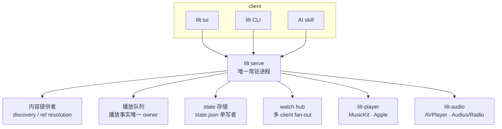

# lilt

[English](README.md) | 简体中文

在终端（macOS / Linux）里播放 **Apple Music、Audius、Jamendo 与网络电台**。可以用 TUI 手动操作，
也可以用 CLI / JSON 写脚本，或让 AI agent 用一句自然语言控制。

```sh
lilt play apple-music:song:1440845629   # 直接播一首 Apple Music
lilt search "Nujabes" --play            # 搜索并播放
lilt radio search --tag lofi            # 搜网络电台
lilt status --json                      # 当前播放状态（给脚本 / agent）
```

> **实现状态**：`lilt serve` 是每个隔离 state root 的唯一常驻 server，持有 helper、播放路由、
> 队列与 `state.json`；TUI、CLI 与 agent skill 是 Client API v0.1 的平等 client。来源有
> Apple Music（macOS 签名 MusicKit helper；Linux 走 Apple 自家 web player 的浏览器引擎）、
> Audius、Jamendo 与统一 Radio（内置精选台 + Radio Browser）。接口版本固定写作 **`v0.1`**，
> 处于快速迭代期，**不做向后兼容**。

## 为什么做这个

- **Apple Music 没有官方 CLI / TUI**，也没有 Linux 客户端；终端党想在终端里听 Apple Music。
- **音乐被分散在各个 App**：想要一个可脚本、可 `--json`、能被自动化调用的统一入口，
  而不是再装一个 GUI。
- **想让 AI agent 直接控制播放**：agent 应当是官方入口，而不是靠脚本去凑。

## 怎么用

### TUI（手动操作）

```sh
lilt tui
```

一次典型操作：`s` 选来源 → `/` 搜 “Nujabes” → `Enter` 播放 → `e` 把下一首加入队列 →
`0` 打开 Up Next 编辑（`x` 删除、`J`/`K` 排序）→ `f` 收藏 → `?` 看全部快捷键 → `q` 退出。
**退出 TUI 不会停止播放**——播放由常驻 server 持有。

### CLI（脚本与自动化）

每个命令都有稳定的 `--json` 信封，只解析 `ok` / `error.code`：

```sh
$ lilt search "Nujabes" --type song --json
{"ok":true,"requestId":"...","data":{ ... }}   # 具体字段以 lilt api --json 为准

$ lilt play apple-music:song:1440845629 --json
$ lilt queue add audius:song:123 --next --json
$ lilt pause --json && lilt next --json
```

需要 server 的命令在没有 server 时会自动启动并重试一次。人类可读用法是 `lilt help`；
机器可读的权威命令目录是 `lilt api --json`（离线可用）。

### AI agent（自然语言）

安装随包发布的 skill 后，可以直接说：

> 放点适合写代码的歌 / 用 Audius 播放 XXX / 放个爵士电台 / 下一首 / 停一下

agent 会读 `lilt sources --json` 里的能力，按优先级选来源并播放，再用 `lilt status --json`
汇报播了什么、为什么。接入方式见 [`docs/guides/agent.md`](docs/guides/agent.md)。

### 常见任务速查

| 我想… | TUI | CLI |
|---|---|---|
| 搜歌并播放 | `/` 搜索 → `Enter` | `lilt search "<词>" --play` |
| 播一个对象 | `Enter` / `p` | `lilt play <source:kind:id>` |
| 听网络电台 | `s` → Radio → Browse | `lilt radio search --tag lofi` |
| 看 / 编辑队列 | `0` | `lilt queue` · `queue add <ref> --next` |
| 收藏 | `f` | `lilt favorite add <ref>` |
| 暂停 / 下一首 / 停止 | `Space` / `n` / `v` | `lilt pause` / `lilt next` / `lilt stop` |
| 看当前状态 | Now Playing 条 | `lilt status --queue --json` |
| 换主题 | `t` | 主题文件放在 `~/.config/lilt/themes/` |

更细的按键、布局与反馈见 [`docs/guides/tui.md`](docs/guides/tui.md)，命令逐条规格见
[`docs/client-api/commands.md`](docs/client-api/commands.md)。

## 支持的内容来源

| 来源 | 能做什么 | 需要什么 |
|---|---|---|
| **Apple Music** | 搜歌 / 专辑 / 歌单、资料库歌单、播放 | macOS 系统账号；订阅=完整播放，否则试听；Linux 走浏览器引擎 |
| **Audius** | 官方 discovery / trending / 歌单，有限队列播放 | 匿名即可；账号关联可选 |
| **Jamendo** | 官方 discovery / trending，有限队列播放 | 免费 `client_id`，仅限非商业 |
| **Radio** | 内置精选台 + Radio Browser 搜索 / 筛选 / 探测，直播播放 | 无需配置 |

来源是**编译期组件**，没有运行期插件；每个来源声明自己的能力，`lilt sources --json` 是唯一真值。
稳定 ref 形态是 `source:kind:id`（如 `apple-music:song:1440845629`、`radio:<url>`）。

## 与其他终端音乐方案的区别

“聚合多个来源”并不是 lilt 的差异点——不少终端播放器（如 cliamp）聚合得更多。lilt 的取舍是：
**把 Apple Music 接进终端**，并让 AI agent 成为官方控制路径，同时保持零本地曲库、一切可脚本化。

| 工具 | 音源 | 平台 | 官方 AI-agent 入口 | 许可 |
|---|---|---|---|---|
| **lilt** | Apple Music + Audius + Jamendo + 网络电台（无本地曲库） | macOS、Linux | **有**（Client API + skill） | MIT |
| cliamp | 本地文件 + YouTube(Music)/SoundCloud/Spotify/NetEase/Yandex/Bilibili/Mixcloud + 电台 + 播客 + 自建服务器 | Linux/macOS/Windows | 无（有 Lua 插件系统） | MIT |
| cmus | 本地文件 + 流 | Unix-like | 无 | GPL-2.0 |
| MPD（+ ncmpcpp/mpc） | 本地文件 + 流，socket 协议 | Unix-like | 无 | GPL-2.0 |
| ncspot | Spotify（需 Premium） | Linux/macOS/Windows/*BSD | 无 | BSD-2-Clause |
| spotify-tui | Spotify Web API | macOS/Linux/Windows | 无 | MIT（社区反馈维护停滞） |
| termusic | 本地文件 + yt-dlp 下载 | macOS/Linux | 无 | MIT（部分模块 GPLv3） |
| yewtube | YouTube（mpv/VLC） | Linux/macOS/Windows | 无 | GPL-3.0 |

- **Apple Music**：上表（以及我调研到的常见终端播放器）里没有其他方案支持 Apple Music；
  lilt 在 macOS 用签名 MusicKit helper，在 Linux 用 Apple 自家 web player 的浏览器引擎。
- **AI-agent 一等入口**：lilt 提供 Client API 与随包 skill，让 agent 用自然语言控制；
  其余工具即使有插件系统，也不是面向 agent 的控制路径。
- **零本地曲库**：lilt 不扫描本地文件、不做 EQ / 频谱 / 歌词；它把在线来源统一到一套
  Item / 队列 / 状态模型，并保证所有操作都有 `--json`。
- 主题 TOML schema 与内置精选台快照分别沿用 [cliamp](https://github.com/bjarneo/cliamp) 与
  [cliamp.stream](https://cliamp.stream/)，lilt 不拥有这些数据。

脚注来源：[cliamp](https://github.com/bjarneo/cliamp)、[cmus](https://github.com/cmus/cmus/releases)、
[MPD](https://www.musicpd.org/news/2025/07/mpd-0-24-5-released/)、
[ncspot](https://github.com/hrkfdn/ncspot/releases)、
[spotify-tui](https://github.com/Rigellute/spotify-tui/issues/1043)、
[termusic](https://crates.io/crates/termusic)、[yewtube](https://pypi.org/project/yewtube/)。

## 安装与快速开始

测试者用 Homebrew 安装公开 beta（当前只覆盖 macOS arm64）；开发者与 Linux 从源码构建。

```sh
# macOS（Homebrew）
brew tap Older-Youth-HZ/lilt
brew install lilt
lilt version

# 源码构建（macOS 需要 Xcode 与 Apple Developer Team）
just build          # Go CLI/TUI + 签名 lilt-player.app 与 lilt-audio.app
./lilt version
```

完整的平台要求、Linux/Nix 用法、外部依赖、数据路径与环境变量见
[`docs/getting-started/install.md`](docs/getting-started/install.md)；第一次授权与播放见
[`docs/getting-started/first-playback.md`](docs/getting-started/first-playback.md)。

## 本地、隐私与信任

- lilt 是**本地播放器 / 客户端**：没有 lilt 云服务、没有遥测；偏好、收藏与播放历史都存在本机，
  凭据只放操作系统安全存储（macOS Keychain）。网络请求只发生在你实际使用的来源上
  （Apple Music / Audius / Jamendo / 电台目录）。
- 随包发布的 **agent skill 会安装进你的 agent 环境**：它只是一份说明（触发、策略、配方），
  通过 `lilt` CLI 工作，不读取本地存储。使用前请自行审查
  [`skills/music-control/SKILL.md`](skills/music-control/SKILL.md)。

## 技术设计

### 组件与所有权



- `lilt serve` 是每个 state root 的唯一 server：播放状态、队列、`activeSource`、`state.json` 的唯一写入者。
- TUI / CLI / skill 都是 client，通过 Client API v0.1 的 Unix socket 访问，不直接持有 helper；
  任一 client 的操作对其他 client 立即可见，TUI 退出也不停止播放。
- 一次操作（如 agent 让 lilt 播放一个歌单）由 server 串行执行有副作用的命令，response 与 watch event
  携带同一个 `state.sequence`，因此天然同步。完整说明见 [`docs/architecture.md`](docs/architecture.md)。

### 来源、provider 与播放传输

- **Source** 是公开内容域（`apple-music`、`audius`、`jamendo`、`radio`）；**provider** 是它的编译期实现，
  负责 discovery、identity 与 canonical ref。**没有运行期插件**。
- provider 把 ref 准备成 transport-specific 的私有播放计划；实际出声的是 playback backend
  （macOS 的 `lilt-player`/`lilt-audio`，Linux 的 mpv 与浏览器引擎）。
- **capability 是唯一真值**：discovery 路由只读 `Descriptor.capabilities`，不另维护“支持列表”；
  不支持的命令返回 `unsupported_command`，不静默降级。
- 短期/签名媒体 URL 绝不进入持久状态、公开 response、watch event、日志或 fixture，只在播放启动时解析。
  详见 [`docs/internals/providers/providers.md`](docs/internals/providers/providers.md) 与
  [`docs/internals/providers/sources.md`](docs/internals/providers/sources.md)。

### 平台与引擎

| 平台 | Apple Music | Audius | Jamendo | Radio |
|---|---|---|---|---|
| macOS | 默认签名 MusicKit helper；`LILT_APPLE_ENGINE=browser` 改用 Apple web player | 官方 REST + helper 有限 URL 队列 | 官方 REST + helper 有限 URL 队列 | AVPlayer 直播流 |
| Linux | 浏览器引擎（Apple web player + Widevine）：catalog、试听、全曲；资料库不可用 | 官方 REST + mpv | 官方 REST + mpv | mpv |

Linux 播放详见 [`docs/internals/playback/linux-mpv-engine.md`](docs/internals/playback/linux-mpv-engine.md)
与 [`docs/internals/playback/apple-web-engine.md`](docs/internals/playback/apple-web-engine.md)。

### 持久化

`state.json` 只保存轻量 UI 偏好（主题、上次来源）；收藏与完整播放历史在 Activity SQLite store。
路径、schema 与迁移规则见
[`docs/internals/persistence/state.md`](docs/internals/persistence/state.md) 与
[`docs/internals/persistence/local-activity.md`](docs/internals/persistence/local-activity.md)。

## 已知限制（摘要）

- 试听时长由上游决定：macOS 原生试听通常约 30 秒；浏览器引擎（Linux，或 macOS 的
  `LILT_APPLE_ENGINE=browser`）实测约 90 秒。完整播放需要有效订阅。
- Apple 的个性化接口（For You、云端最近播放）在本机签名 bundle 上失败，已接受；`lilt recent` 是
  lilt 本地历史，不是 Apple 的“最近播放”。
- 收藏是 lilt 本地列表，不写 Apple Music（公开 API 没有收藏读写）。
- 不做 seek / 音量 / 实时码率 / 频谱；不做本地文件、播客、歌词。
- 不创建或编辑 Apple Music 资料库歌单；lilt 不维护自己的歌单文件。
- Linux 的 Apple Music 不提供资料库 / 个人歌单 / 推荐。
- Jamendo 需用户自备 `client_id`，且仅限非商业使用。

完整、带证据的限制见 [`docs/product/limitations.md`](docs/product/limitations.md)。

## 文档导航

### 给使用者

| 主题 | 入口 |
|---|---|
| 安装与第一次播放 | [`docs/getting-started/`](docs/getting-started/README.md) |
| TUI 日常操作 | [`docs/guides/tui.md`](docs/guides/tui.md) |
| CLI / JSON 脚本 | [`docs/guides/cli-and-scripting.md`](docs/guides/cli-and-scripting.md) |
| AI agent 接入 | [`docs/guides/agent.md`](docs/guides/agent.md) |
| 网络电台 | [`docs/guides/radio.md`](docs/guides/radio.md) |
| 排障、日志、错误码 | [`docs/guides/troubleshooting.md`](docs/guides/troubleshooting.md) |

### 给开发者 / 集成者

一切都从文档地图开始：[`docs/README.md`](docs/README.md)。

| 主题 | 入口 |
|---|---|
| 系统架构与所有权 | [`docs/architecture.md`](docs/architecture.md) |
| Client API v0.1 契约 | [`docs/client-api/README.md`](docs/client-api/README.md) |
| 实现契约（provider / 播放 / 持久化） | [`docs/internals/README.md`](docs/internals/README.md) |
| TUI 产品与设计 | [`docs/ui/README.md`](docs/ui/README.md) |
| 产品路线、限制、发布 | [`docs/product/README.md`](docs/product/README.md) |
| 测试分层与 provider 准入 | [`docs/testing/README.md`](docs/testing/README.md) |

## 开发

```sh
just build          # Go + 签名 helper（Linux 上仅 Go）
just test           # go test/vet + swift build/test（Swift 仅 macOS）
just verify         # 无凭证全量门禁：docs/fmt/workflow + go test/race/vet + swift + git diff --check
just provider-gate  # provider 准入：go test -race ./... + go vet ./...
just fake           # 开发构建的私有、假播放 TUI
```

贡献与测试约定见 [`AGENTS.md`](AGENTS.md) 和 [`docs/testing/`](docs/testing/README.md)。

## License

[MIT](LICENSE)。
