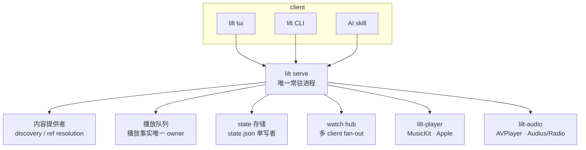

# lilt

[English](README.md) | 简体中文

macOS 与 Linux 上的 **Apple Music、Audius、Jamendo 与网络电台终端控制器**。它既能用人手在
TUI 里操作，也能被 CLI 与 AI agent 编程控制；三种入口走同一份 Client API，共享同一个播放队列与状态。

```sh
lilt tui                       # 全屏手工界面
lilt search "Nujabes" --play   # 搜索并播放
lilt status --json             # 给脚本与 agent 消费
lilt play apple-music:song:1440845629
```

> **实现状态**：`lilt serve` 是每个隔离 state root 的唯一常驻 server，持有 helper、播放路由、
> 队列与 `state.json`；TUI、CLI 与 agent skill 是 Client API v0.1 的平等 client。已实现的来源是
> Apple Music（macOS 签名 MusicKit helper；Linux 走 Apple 自家 web player 的浏览器引擎）、
> Audius、Jamendo，以及统一 Radio（内置精选台 + Radio Browser）。接口版本固定写作 **`v0.1`**，
> 处于快速迭代期，**不做向后兼容**。

## 为什么做这个

- Apple Music 没有官方 CLI 或 TUI；终端重度用户想在终端里听 Apple Music、独立音乐与电台，
  只能在不同工具之间来回切换。
- 一个常驻 server 持有播放、队列与状态，TUI/CLI/agent 都是它的 client——任何一方操作，
  其他立刻可见；TUI 退出也不会停止播放。
- AI agent 是**一等入口**，不是事后补的功能：接口原语保持确定性，自然语言理解与候选判断交给 skill。

## 功能总览

**三种入口，同一份契约**

- **TUI**（`lilt tui`）：完整手工操作，source 切换、聚合首页、命令面板、主题、帮助。
- **CLI**（`lilt`）：每个命令都有稳定的 `--json` 信封，适合脚本与自动化；人类可读用法是 `lilt help`。
- **AI agent skill**（[`skills/music-control/`](skills/music-control/SKILL.md)）：自然语言编排，
  只写触发、策略与配方，接口细节从 `lilt api --json` 读取。

**四个来源**

| 来源 | 内容 | 播放 |
|---|---|---|
| Apple Music | 搜索、资料库歌单、目录歌单/歌曲/专辑 | 完整播放（订阅）；无订阅/未授权回退约 30 秒试听 |
| Audius | 官方 public discovery、trending、歌单 | 有限 URL 队列；账号 OAuth 可选 |
| Jamendo | 官方 public discovery、trending | 有限 URL 队列；需自备免费 `client_id`，仅限非商业 |
| Radio | 内置精选台 + Radio Browser 目录、搜索与筛选 | 直播单流 |

**播放与控制**

- 有限队列（Apple Music / Audius / Jamendo）与直播单流（Radio）严格互斥。
- 队列可编辑：播下一首 / 追加、删除、重排、跳转、清空；shuffle / repeat；暂停/继续/停止。
- lilt 本地收藏与播放历史（SQLite），以及从历史派生的 Recent。
- Now Playing 条显示进度、格式与 shuffle/repeat；直播显示 `LIVE`。
- macOS 上把 Now Playing 元数据发布到系统媒体控制（控制中心、锁屏、媒体键）。

**界面与运维**

- 主题沿用 cliamp 的 TOML schema；聚合首页（Continue Playing、Recently Played、Trending、
  Your Playlists、Favorites、Go to）。
- 结构化 JSON 日志、`lilt log`、`lilt doctor`。
- 本地优先：偏好与收藏都在本机；凭据只放操作系统安全存储。

## 使用场景

1. **手动听歌**：`lilt tui`，用 `s` 换来源、`/` 搜索、`e`/`E` 入队、`f` 收藏。见
   [`docs/guides/tui.md`](docs/guides/tui.md)。
2. **脚本与自动化**：所有命令加 `--json`，只解析 `{"ok":…}` 信封；命令无 server 时自动启动并重试一次。
   见 [`docs/guides/cli-and-scripting.md`](docs/guides/cli-and-scripting.md)。
3. **AI agent 编排**：对 opencode 等编码 agent 说“播放适合作息的歌 / 放个电台 / 下一首”，由 skill
   按 capability 选来源并汇报。见 [`docs/guides/agent.md`](docs/guides/agent.md)。
4. **听网络电台**：Radio Browse 默认 Popular Worldwide，`/` 打开 Search & Filters，
   本机探测可播放性且不阻塞播放。见 [`docs/guides/radio.md`](docs/guides/radio.md)。
5. **跨来源聚合**：一个 server 同时接 Apple Music、Audius、Jamendo、Radio；开始某个来源会停止另一个，
   但发现与授权互不影响。
6. **Linux 上听 Apple Music**：浏览器引擎承载 catalog、试听与全曲，`lilt auth apple-music` 登录；
   资料库/个人歌单/推荐在 Linux 不可用。

## 与其他终端音乐方案的区别

lilt 的定位与常见终端音乐工具不同：它们大多播本地文件或单一流媒体，而 lilt 聚合多个在线来源，
并把 AI agent 作为官方控制路径。下表是 2026-09-25 的快照，来源见脚注；未能证实的项标注“未验证”。

| 工具 | 音源/后端 | 平台 | 官方 AI-agent 入口 | 许可 |
|---|---|---|---|---|
| **lilt** | Apple Music + Audius + Jamendo + 网络电台 | macOS、Linux | **有**（CLI + agent skill） | MIT |
| cmus | 本地文件 | Unix-like | 无 | GPL-2.0 |
| MPD（+ ncmpcpp/mpc） | 本地文件 daemon，socket 协议 | Unix-like | 无 | GPL-2.0 |
| ncspot | Spotify（需 Premium） | Linux/macOS/Windows/*BSD | 无 | BSD-2-Clause |
| spotify-tui | Spotify Web API | macOS/Linux/Windows | 无 | MIT（社区反馈维护停滞） |
| termusic | 本地文件 + yt-dlp 下载 | macOS/Linux | 无 | MIT（部分模块 GPLv3） |
| yewtube | YouTube（mpv/VLC） | Linux/macOS/Windows | 无 | GPL-3.0 |

lilt 的关键差异：

- **上表唯一支持 Apple Music 的方案**：macOS 用签名 MusicKit helper，Linux 用 Apple 自家 web player
  的浏览器引擎；上表其余工具的音源是本地文件、Spotify、YouTube 或自建流媒体服务器。
- **官方 AI-agent 控制路径**：Client API over Unix socket + 自然语言 skill，是上表中唯一提供
  一等 agent 入口的方案。
- **多在线来源聚合、零本地曲库**：lilt 不扫描本地文件、不做播放列表文件管理；它把在线来源统一到
  同一套 Item / 队列 / 状态模型。
- **MIT 许可**：上表多为 GPL 系。

脚注来源：[cmus](https://github.com/cmus/cmus/releases)、[MPD](https://www.musicpd.org/news/2025/07/mpd-0-24-5-released/)、
[ncspot](https://github.com/hrkfdn/ncspot/releases)、[spotify-tui](https://github.com/Rigellute/spotify-tui/issues/1043)、
[termusic](https://crates.io/crates/termusic)、[yewtube](https://pypi.org/project/yewtube/)。

## 安装与快速开始

测试者用 Homebrew 安装公开 beta（当前只覆盖 macOS arm64）；开发者与 Linux 从源码构建。

```sh
# macOS（Homebrew）
brew tap Older-Youth-HZ/lilt
brew install lilt
lilt version

# 源码构建（macOS 需要 Xcode 与 Apple Developer Team）
just build          # Go CLI/TUI + 签名 lilt-player.app 与 lilt-audio.app
./lilt version
```

完整的平台要求、Linux/Nix 用法、外部依赖、数据路径与环境变量见
[`docs/getting-started/install.md`](docs/getting-started/install.md)；第一次授权与播放见
[`docs/getting-started/first-playback.md`](docs/getting-started/first-playback.md)。

## 技术设计

### 组件与所有权



- `lilt serve` 是每个 state root 的唯一 server：播放状态、队列、`activeSource`、`state.json` 的唯一写入者。
- TUI / CLI / skill 都是 client，通过 Client API v0.1 的 Unix socket 访问，不直接持有 helper；
  TUI 退出不停止播放。
- 一次操作（如 agent 让 lilt 播放一个歌单）由 server 串行执行有副作用的命令，response 与 watch event
  携带同一个 `state.sequence`，因此天然同步。完整说明见 [`docs/architecture.md`](docs/architecture.md)。

### 来源、provider 与播放传输

- **Source** 是公开内容域（`apple-music`、`audius`、`jamendo`、`radio`）；**provider** 是它的编译期实现，
  负责 discovery、identity 与 canonical ref。**没有运行期插件**。
- provider 把 ref 准备成 transport-specific 的私有播放计划；实际出声的是 playback backend
  （macOS 的 `lilt-player`/`lilt-audio`，Linux 的 mpv 与浏览器引擎）。
- **capability 是唯一真值**：discovery 路由只读 `Descriptor.capabilities`，不另维护“支持列表”；
  不支持的命令返回 `unsupported_command`，不静默降级。
- 稳定 ref 形态是 `source:kind:id`；短期/签名媒体 URL 绝不进入持久状态、公开 response、watch event、
  日志或 fixture，只在播放启动时解析。详见
  [`docs/internals/providers/providers.md`](docs/internals/providers/providers.md) 与
  [`docs/internals/providers/sources.md`](docs/internals/providers/sources.md)。

### 平台与引擎

| 平台 | Apple Music | Audius | Jamendo | Radio |
|---|---|---|---|---|
| macOS | 默认签名 MusicKit helper；`LILT_APPLE_ENGINE=browser` 改用 Apple web player | 官方 REST + helper 有限 URL 队列 | 官方 REST + helper 有限 URL 队列 | AVPlayer 直播流 |
| Linux | 浏览器引擎（Apple web player + Widevine）：catalog、试听、全曲；资料库不可用 | 官方 REST + mpv | 官方 REST + mpv | mpv |

Linux 播放详见 [`docs/internals/playback/linux-mpv-engine.md`](docs/internals/playback/linux-mpv-engine.md)
与 [`docs/internals/playback/apple-web-engine.md`](docs/internals/playback/apple-web-engine.md)。

### 持久化

`state.json` 只保存轻量 UI 偏好（主题、上次来源）；收藏与完整播放历史在 Activity SQLite store。
路径、schema 与迁移规则见
[`docs/internals/persistence/state.md`](docs/internals/persistence/state.md) 与
[`docs/internals/persistence/local-activity.md`](docs/internals/persistence/local-activity.md)。

## 已知限制（摘要）

- Apple 的个性化接口（For You、云端最近播放）在本机签名 bundle 上失败，已接受；`lilt recent` 是
  lilt 本地历史。
- 收藏是 lilt 本地列表，不写 Apple Music（公开 API 没有收藏读写）。
- 不做 seek / 音量 / 实时码率 / 频谱；不做本地文件、播客、歌词。
- 不创建或编辑 Apple Music 资料库歌单；lilt 不维护自己的歌单文件。
- Linux 的 Apple Music 不提供资料库 / 个人歌单 / 推荐。
- Jamendo 需用户自备 `client_id`，且仅限非商业使用。

完整、带证据的限制见 [`docs/product/limitations.md`](docs/product/limitations.md)。

## 文档导航

| 主题 | 入口 |
|---|---|
| 安装与第一次播放 | [`docs/getting-started/`](docs/getting-started/README.md) |
| TUI / CLI / agent / 电台 / 排障 | [`docs/guides/`](docs/guides/README.md) |
| 系统架构与所有权 | [`docs/architecture.md`](docs/architecture.md) |
| Client API v0.1 契约 | [`docs/client-api/README.md`](docs/client-api/README.md) |
| 实现契约（provider/播放/持久化） | [`docs/internals/README.md`](docs/internals/README.md) |
| TUI 产品与设计 | [`docs/ui/README.md`](docs/ui/README.md) |
| 产品路线、限制、发布 | [`docs/product/README.md`](docs/product/README.md) |
| 测试分层与 provider 准入 | [`docs/testing/README.md`](docs/testing/README.md) |
| 文档地图 | [`docs/README.md`](docs/README.md) |
| AI agent skill | [`skills/music-control/SKILL.md`](skills/music-control/SKILL.md) |

## 开发

```sh
just build          # Go + 签名 helper（Linux 上仅 Go）
just test           # go test/vet + swift build/test（Swift 仅 macOS）
just verify         # 无凭证全量门禁：docs/fmt/workflow + go test/race/vet + swift + git diff --check
just provider-gate  # provider 准入：go test -race ./... + go vet ./...
just fake           # 开发构建的私有、假播放 TUI
```

接口的机器可读权威目录是 `lilt api --json`（无需 server）；人类可读用法是 `lilt help`。
贡献与测试约定见 [`AGENTS.md`](AGENTS.md) 和 [`docs/testing/`](docs/testing/README.md)。

## License

[MIT](LICENSE)。
