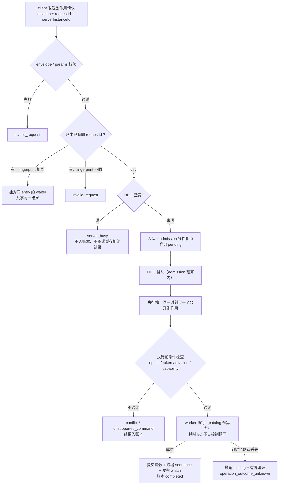
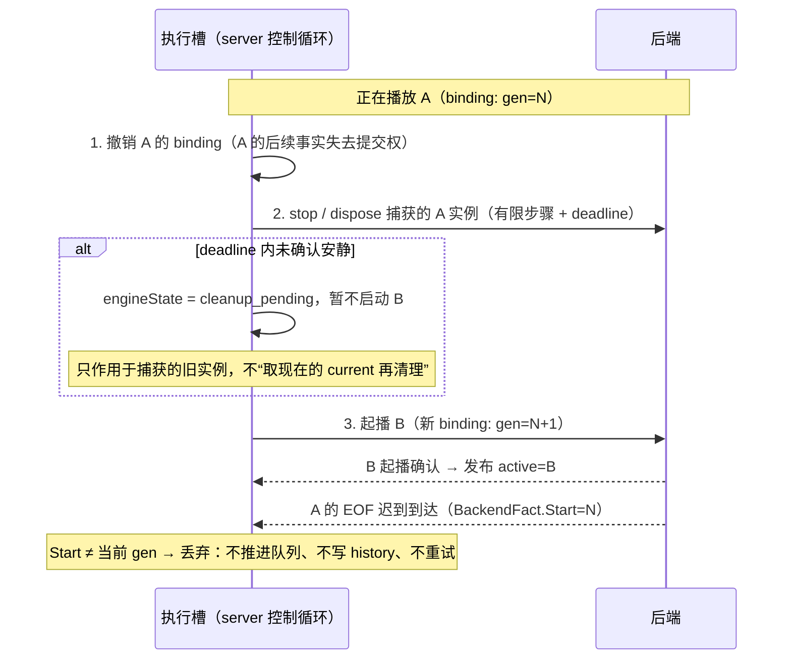
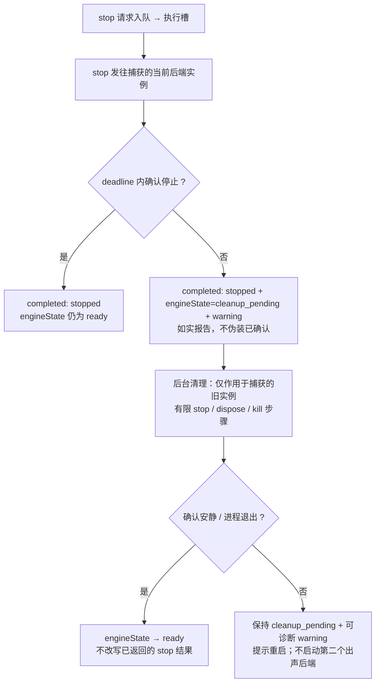
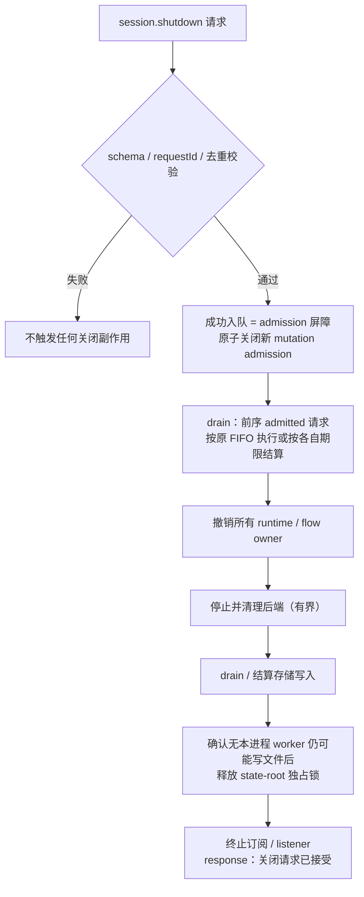

# 设计提案：端到端命令顺序与异步生命周期

> **状态：设计已接受；第 1 阶段与第 2 阶段的一部分已实施（见 §12.1），其余仍未实施。**
> 已实施部分以 [Client API v0.1](../client-api/README.md) 的现行规范为准（`protocol.md` 的
> server epoch 与有界 admission、`errors.md` 的 `server_busy`、`watch.md` 的重连 epoch 规则）；
> 未实施部分只是目标，不是当前能力声明，也不改变现行
> [helper 协议](playback/helper-rpc.md) 或 [UI 异步契约](../ui/async-state.md)。
> 实施按第 12 节推进，不维护两套协议、不新增兼容分支。
>
> **适用范围：** 同一隔离 state root 内，TUI / CLI / agent、server、provider、播放适配器、
> Swift helper / mpv / 浏览器、后台任务、watch 和持久化之间的通讯。
> 不提供多 server 共用同一 root、跨机器协调或账号 / 音频设备隔离。

## 1. 先读结论

**问题不是只有“同时写”，还有“旧操作的结果被当成新操作的事实”。** 锁和串行 RPC 能解决前者，
不能单独解决后者。统一方案是：**server 单写者 + 显式命令顺序 + 有界等待 + 条件更新 + 生命周期校验**。

| 用户问题 | 当前判断 | 目标规则 |
|---|---|---|
| TUI 连按两次 next | 已有 mutation 单槽；忙时拒绝第二次，不是保证两次执行 | 保留明确的忙碌反馈，不暗中吞掉或排队手势 |
| agent 同时启动几个 CLI | 每次调用是独立连接；启动先后不等于 server 执行先后 | 有依赖就等待上条 response；需要并行时接受 server 的入队顺序 |
| 两个 client 同时操作 | server 串行修改避免数据竞争，但仍可能按旧视图操作新状态 | 普通命令针对执行时的当前状态；针对所见曲目 / 队列的操作使用条件更新 |
| next 后收到旧曲目的 EOF | 即使完全串行，仍可错跳下一首 | 旧起播身份不能作用于当前起播；当前 EOF 也只能推进一次 |
| 停止或切换超时 | 逻辑 stopped 不证明底层已停止、旧消息也不会凭空消失 | 先撤销旧写权限；清理有界且可观察；未确认清理前不启动另一出声后端 |

不引入消息中间件、分布式共识、持久命令日志、跨 client 锁或通用 workflow 框架。
需要调整的是现有控制边界，而不是为每个曲目、来源和回调追加特例。

**阅读路径：** 第 2 节看现状；第 3–5 节看方案与排序；第 6–9 节看各通讯边界；
第 10–12 节看协议影响、验收和实施；第 13 节把同一套规则画成示意数据结构与流程图。
阅读提案不需要先读所有实现文件。

## 2. 当前架构：哪些边界会出现同类问题

以下是基线 `7248496` 的代码核对，不把潜在风险写成已复现故障，也不把现有局部保护当作端到端保证。

| 边界 | 已有保护与证据 | 尚未闭环的风险 |
|---|---|---|
| client → server 命令 | `internal/server/server.go` 的 `s.mu` 串行副作用；`internal/server/dedup.go` 按 requestId 去重 | mutex 不承诺连接 / goroutine 的 FIFO；排队等待未纳入 server 命令执行超时；连接断开不等于取消已接收命令 |
| TUI 手势 / 请求 → TUI model | `internal/tui/model.go` 的 action、list token；同一 model 的 mutation 单槽；[UI 异步契约](../ui/async-state.md) | 这些 token 是本 client 的，不隔离其他 client，也不替代 server 生命周期身份 |
| 队列视图 → 队列写入 | `ifQueueRevision`、undo token，见 `internal/server/handlers_playback.go` 与 [命令规范](../client-api/commands.md) | revision 只覆盖队列编辑域；单独一个数字无法识别另一次 server 生命周期，普通 next 也没有“只操作所见曲目”的条件 |
| response / watch → client 状态 | `internal/server/watch.go` 分配全局 sequence，snapshot + fan-out；TUI 过滤旧 playback sequence | watch 与 response 来自不同连接；重连、其他投影的刷新、初始化查询也需要统一合并规则，不能只比较 playback |
| server → driver → 本地播放器 | generation/session；URL 队列拥有公开队列；audio helper 已校验 AVPlayer 实例，见 `AudioPlayback.swift`、`LiltHelperKit.swift` | URL generation/session 是整次队列会话，同曲重试 / 换项复用；实例身份未作为统一端到端起播身份 |
| server ↔ native MusicKit | `internal/player/client.go` 顺序 RPC；Swift `MainActor` 与有界起播确认 | native 请求 / 状态尚未统一携带 URL 路径的 ownership envelope；顺序 RPC 不证明 observer、计时采样和 async task 属于最新 entry |
| server ↔ browser / mpv | `internal/playrouter/player.go` 的 Apple epoch、`internal/mpvplayer/client.go` 的 session 检查与状态流 | router 的部分 URL 控制只看当前 backend；浏览器按 ItemID 去重结束不能区分同曲的新 occurrence；mpv 的普通 property-change 未统一关联原生文件实例 |
| provider / 资源 runtime → server | provider 自有锁、请求 context；播放 plan 私有；resource runtime 与 playback 分离 | 解析 / warmup 跨 logout、runtime 更换或源切换后完成，必须检验对应 owner，不能仅因请求返回成功就提交 |
| OAuth / callback → 凭据与授权投影 | server-owned flow；Audius 已用 revision、commit 锁保护凭据，见 `auth_audius.go` 与 lifecycle 测试 | 不能把 Audius 的局部保护等同所有 auth、浏览器 profile 生命周期和后台刷新都已覆盖 |
| ICY / tick / retry / recent → server | `internal/server/engine_supervisor.go` 的 ICY generation；自动换项有超时；Recent 用 occurrence 与 SQLite 去重 | 调度时的 owner 必须一路带到提交；迟到采样不能重新创建已失效 occurrence，后台重试不能恢复已被用户暂停的播放 |
| server → 存储 → watch | `stateview.go` 的统一成功提交入口；`app_revision_test.go`；Activity 事务与 occurrence 唯一索引 | SQLite、偏好文件和实际音频不是同一个事务；不能让 revision 看起来覆盖了所有资源 |

有两类问题，处理方式不能混淆：

- **局部实现问题：** owner 已清楚，但某个 callback、response 或失败分支漏校验 / 漏清理。
- **架构问题：** 没有定义入队顺序、身份覆盖范围、异步提交边界、重建隔离和 client 合并规则。
  本文解决后一类；以后修前一类时必须对照统一契约，而不是再创造一套身份或重试规则。

## 3. 经典方案与选择理由

| 可借鉴模式 | 解决什么 | 在 lilt 中的选择 |
|---|---|---|
| Single writer / actor / reactor | 让共享业务状态只有一个提交点 | server 的控制循环拥有权威状态；耗时 I/O 在 worker / adapter 内，结果回控制循环 |
| FIFO command queue + backpressure | 明确多连接命令顺序，限制等待和内存 | 副作用命令有界 FIFO；查询独立；忙时明确拒绝，不无限排队 |
| Optimistic concurrency / CAS | 防止基于旧视图的写入 | 保留队列 revision；增加 server epoch 与当前播放条件；不引入 client 独占锁 |
| Idempotency key + bounded result ledger | 防止重试执行两次非幂等操作 | 复用 requestId / fingerprint；同 ID 同意图共享结果；未知结果不换 ID 自动重放 |
| Epoch / fencing token + observation sequence | 让旧生命周期、旧采样失去写权限 | owner 身份检验在副作用之前；每个 backend 的观察序号合并 response 与通知 |

**排序、去重和失效是三个不同问题。** requestId 不表示调用顺序；sequence 不证明生命周期有效；
取消 context 不证明已经排队的 callback 消失。三者都需要，但不能互相替代。

为什么不用其他方案：

- **只扩大 mutex：** 会继续在网络、起播确认、清理时持锁；等待无界和旧结果归属问题仍在。
- **全链路等消息排空：** 既不能证明平台内部再无 callback，又容易产生“命令等通知、通知等命令锁”的互等。
- **默认 last-write-wins / 合并用户命令：** 可以把两次 next 变成一次，或吞掉明确的 pause；不是本产品的语义。
- **多 client lease / 分布式锁：** 本来只有一个 server；增加抢锁、过期、续租和 UI 解释，没有必要。
- **持久 exactly-once / 两阶段提交：** 无法把 MusicKit、AVPlayer、mpv、浏览器与两个本地存储做成统一事务。
  保证应是限定窗口内去重、状态可核对、未知结果明确，而不是“全系统恰好一次”。

## 4. 统一所有权与身份

### 4.1 单写者与 I/O 的分离

目标控制循环只做：接收命令 / 事实、验证前置条件、决定下一步、提交内存投影、分配版本、发布 watch。
不在这个循环中等待 HTTP、CDP、helper 起播、进程退出或磁盘写入。

```text
client connections ── validation / dedup ── bounded mutation FIFO ─┐
backend facts / worker completions ── bounded control inbox ──────┤
                                                               ▼
                                                     server control loop
                                                       │     ▲
                                        immutable job  │     │ owned result
                                                       ▼     │
                                             I/O worker / adapter owner

read queries ── immutable committed view / bounded provider workers
watch hub    ◄─ committed snapshots and occurrence events
```

公开副作用命令只有一个**执行槽**。运行中的命令可以等待 worker，但循环仍接收事实、提供查询、
处理超时和更新命令账本。后续公开副作用命令不能越过这个执行槽。

每个实际后端另有一个控制 owner，串行执行其生命周期和播放控制；Swift 可以使用 MainActor / actor，
Go 可以用现有类型内的串行控制器。网络 reader / observer 只传递事实，不直接改 server 队列或持久状态。
**不要求每个函数新建 actor，也不新增通用 actor 库。**

### 4.2 身份各管一件事

| 身份 / 版本 | 分配者与生命周期 | 用途与禁区 |
|---|---|---|
| `requestId` / 私有 RPC id | client / RPC transport；一条逻辑请求 | 关联 response、去重；不决定排序，不充当播放身份 |
| `serverInstanceId` + public `sequence` | server 启动随机 epoch；本进程递增 sequence | client 合并已提交投影；跨 epoch 不比较数字；sequence 不是事件数 |
| playback binding：server epoch、backend instance、transport session、start generation | server；backend 更换、会话更换或一次新起播时改变对应层 | 私有控制、response、通知、采样、清理共同使用；曲目 ref 不是 owner |
| `backendSequence` + native `entryEpoch` | backend owner；观察序号在 backend instance 内递增；自主切项时更新 entry epoch | 观察顺序与 native 队列 occurrence；不拿 public sequence 过滤 backend，也不拿 ItemID 去重 EOF |
| 领域 token | 相应 owner：queue revision、AppState revision、auth flow/revision、source runtime epoch、ICY generation、history occurrence；client 本地 query/action/watch token | 每个域只比较自己的版本；不能以一个全局 generation 代替所有生命周期 |

**一次新起播**包括换队列项、同曲 retry、jump、previous 导致重新起播，以及替换播放器实例。
从普通暂停恢复不换 start generation，但改变该起播的 desired state / intent revision；
从 ended 重新开始即使入口叫 resume，也必须建立新起播身份，不能复活已结束 occurrence。
`transportSessionID` 仍表示一条逻辑播放会话，不能承担“本次尝试”的去重职责。

native MusicKit 可以自主换 entry，无需 server 逐首 start：保留 session/start binding，由 helper
在**确认原生 entry 边界**时递增 `entryEpoch`，server 据此创建新的逻辑播放 occurrence。
重复曲目必须使用 native entry 身份 / canonical queue 行等确证，不能只比较歌曲 ID。
若平台不提供足够身份，不猜测边界：通知仅触发受 ownership 校验的当前状态读取，不据此推进队列或记历史。
具体原生映射能力需在 adapter 实施阶段证明，不能靠新增字段宣称已经解决。

公开的 `playbackToken` 是 server 给“当前播放 occurrence / 起播尝试”的不透明 token，含 epoch 的隔离语义。
它在实际切项、retry 或重启后失效，暂停时不变；不暴露私有 backend / session 身份或媒体 URL。
不以 token 代替 queueRevision：移除队列另一行和暂停当前播放是不同条件域。

### 4.3 写权限在哪里检查

启动先建立 pending binding，再发 I/O。worker、observer、定时器捕获不可变 binding，完成时带回；
owner 在实际副作用前、异步完成后和 server 提交前检验它。

```text
capture owner → async work → validate same owner → apply side effect / submit result
```

必须在**所有会修改外部资源的位置**校验：play / pause / stop、credentials commit、封面与 Now Playing
写入、browser close、process kill。只在 server 收到结果后丢弃已经发生的错误副作用不够。
清理只能作用于捕获的具体旧对象 / PID / browser；禁止“取现在的 current 然后清理”。

失效先于取消和清理。移除 observer、取消任务、关闭旧连接用于资源回收，不能替代 owner 校验。
任一 identity 缺失或无法验证的消息不得冒充当前事实；不要给它补上“此刻的 current generation”。

## 5. 单 client、快速指令与多 client 的确定语义

### 5.1 入队顺序与请求阶段

副作用请求依次经历 `received → validated → admitted → executing → completed`。
这是内部状态，不新增公共 job API。

- 验证 envelope / params 后，以 requestId 查账本。新请求的登记与 admission 原子决定；同一请求只入队一次，其他连接等待同一结果。
- admission 是 FIFO 顺序的线性化点：只承诺成功入队后的顺序，不承诺进程启动、连接 accept 或网络发送顺序。
- 开始执行时检查 CAS、capability、source / runtime epoch；入队时通过不等于执行时仍通过。
- 同一执行槽内先完成权威提交，再释放后续命令。通知可穿插；迟到结果必须按 ownership 和版本裁决。
- response 是这个请求的结果；不是禁止其他 client 在 response 到达前继续改状态的锁。

相对命令 `next/previous/toggle` 默认操作**执行时**的当前播放。未加条件的两个 next 若均成功，
就是两次 next；两个相反的 desired-state 命令按 FIFO 执行，后者成为最终意图，不合并、不静默拒绝。

### 5.2 client 如何保留用户意图

| client / 操作 | 规则 |
|---|---|
| agent / 脚本中的有依赖指令 | 等待上一条成功 response，再发下一条；失败时不盲目继续后继动作 |
| TUI 连续手势 | 继续遵守现有 mutation 单槽；忙时显式反馈。此次设计不新增按键排队或抢占行为 |
| 基于所见队列的编辑 | 带 `ifServerInstanceId` 和 `ifQueueRevision`；index / undo token 只能用于匹配版本 |
| 基于所见曲目的 next / pause / stop 等 | 支持对象条件的 source 带 `ifPlaybackToken`；对象已变返回 `conflict`。不能证明原子对象控制的 backend 不声明该能力，见第 6 节 |
| 明确的全局命令 | 可以不带播放条件，例如 agent 的“停止现在的播放”；调用者选择当前态语义，承担与其他 client 的正常排序 |

`ifServerInstanceId` 拟放在 request envelope，对副作用命令必填；纯查询可省略。
epoch 的存在理由是**时间上的进程替换，不是并发多 server**：同一 root 永远只有一个 server 进程，
但崩溃后由下一次 client 调用拉起的新进程、`just promote` / `just stop-daily` 或手动重启都会把
socket 对端换成新进程，而 `sequence` 与 `queueRevision` 都是进程内计数器，重启后从零开始
（`server.go` 的字段在启动时零值）。没有 epoch，旧 client 缓存的 `ifQueueRevision=5` 会在
新 server 重新增长到 5 时误命中（CAS 假阳性）；重试的 requestId 也会在空账本上静默重执行。
CLI / agent client 在首次 mutation 前用现有 session 查询取得 epoch，TUI 使用已建立的 watch snapshot；
有 epoch 的 client 自动携带，不能把重启前仍未发送的请求投递到新 server。重试也必须带原 epoch，
否则仅相同 requestId 无法阻止跨重启重执行。检查 epoch 失败返回 `conflict`，未提供则 `invalid_request`。
`ifQueueRevision` / `ifPlaybackToken` 放在相应命令 params；播放 token 另提供 occurrence 隔离。
播放对象条件覆盖 pause / resume / toggle / next / previous / stop；新的 play 是替换意图，不自动附加当前
播放条件。shuffle / repeat 属于逻辑队列操作，条件使用 queue revision，不借用 track token。
条件不匹配发生在任何控制副作用之前，返回 `conflict`，不重试、不帮 client 用新版本改写参数。
client 读取新状态并由用户 / agent 重新决定。TUI 的 latest-query-wins 只用于结果显示，不用于吞掉副作用请求。

队列自然推进与显式 next 竞争时，自动推进也是带当前 occurrence 条件的内部动作，进入同一执行序列。
已有公开命令不能被自动动作越过；动作开始时重新验证 owner，最多消费一次当前 EOF。
支持对象条件时，TUI 的 next 带所见 token：两者无论谁先完成，都不能把旧 A 的一次操作再用于 B。
**不带 token 的 next 针对当前态，不能承诺与另一来源的自动推进合并为“一次”。**

### 5.3 等待、取消与幂等

排队等待与实际执行使用两个明确预算：admission wait 和 catalog 声明的执行 budget。
client 的调用 deadline 覆盖两者及有界传输余量。不新增 envelope 级 `timeoutMs`：server 不知道任意
client 私有的本地超时，不能在没有共享 timeout 或断连证据时声称所有提前放弃都能被及时识别；
admission / execution 预算已保证排队请求有界终止，更短的等待属于 client 自己的 deadline，
不需要 server 提供第二个可缩短预算的字段。具体 admission budget 在实施时统一进 catalog / client，
不在 server 与 client 各写一份不同常量。

连接数、读 frame 的字节 / 时间、排队 mutation、重复 waiters、watchers、provider workers 和各 inbox
均有明确上限；在 decode 前限制 frame，而不是分配完大对象才校验。核对状态的只读通道保留容量，
长 watch / provider 查询不能占满它。具体数值在第 1 阶段冻结为内部预算并测试，不增加用户配置框架。

| 失败点 | 对外结果 | 是否可能有副作用 |
|---|---|---|
| 队列满、排队超时，尚未 executing | 拟新增 `server_busy`，说明未执行；已 admitted 的终止结果记入账本，未接收的拒绝不承诺缓存 | 否 |
| 执行前条件失效 | `conflict` 或既有 capability / state 错误 | 否 |
| worker 确认未提交且取消成功 | 对应已知失败；终止本次执行槽 | 不把“取消已发送”当作确认未提交 |
| 后端命令已发出，确认 / 连接丢失 | `operation_outcome_unknown`；撤销 binding、进入清理 / 核对 | 可能 |
| 成功结果已提交，response 丢失 | 同 requestId 重取结果；新请求读状态 | 已发生 |

断开连接仅能撤销**仍在排队且没有其他活跃同 ID waiter**的请求；executing 后不能假定撤销了副作用。
连接读取器统一报告断连，不在 JSON decoder 之外新增竞相读取同一 socket 的 goroutine。
授权 flow 在 begin 成功后属于 server，不因原调用者断线取消。

FIFO 不提供 stop 抢占：stop 不能越过一个已经执行的 start。后者必须在已声明 budget 内完成或进入
有界失效 / 清理；后续 stop 的排队也可超时。这与现状一致：今天的 mutation 本来就在 server 内串行，
stop 本来就要等执行中的 play 结束；提案只是把这个语义写明，不是新增倒退。这是刻意的产品取舍，
不宣称“按 stop 立即中止”。
若要改为抢占，必须另定义被取消命令的结果、pause 与 start 的意图关系和验收，不能用优先级补丁偷偷加入。

去重账本沿用 requestId + 规范化参数 fingerprint。pending、结果 body、tombstone 和重复请求 waiters
必须都有条目 / 字节上限；不得为了腾空间删除保护中的 mutation tombstone 后重执行。
满时拒绝新 mutation；这种 admission 前的拒绝不占新账本条目，不声称缓存拒绝结果；已接收请求的
去重保证不能因此缩短。核对当前状态的纯查询仍须可用。目标去重保证针对副作用命令，纯查询每次读取
当前视图；实施时须同步现行通用去重说明，不能把这个范围变化隐瞒在代码里。
去重是 server epoch 内、有限保留窗口的保证；跨重启、窗口外不能声称恰好一次。未知结果的非幂等命令
禁止自动换 requestId 重试；即使 desired-state 命令幂等，也须重新确认当前 epoch / 对象。
读当前队列不总能证明非幂等命令是否执行，例如队列含重复歌曲时不能据此判断一次 add 是否发生；
结果不可恢复时必须保留这个不确定性，而不是凭现状猜测后自动重放。

### 5.4 shutdown 是 admission 屏障

`session.shutdown` 通过 schema / requestId / 去重检查并成功入队时，原子关闭新的 mutation admission。
拒绝或复用失败结果的 shutdown 不触发任何关闭副作用；重复成功请求共享同一关闭结果。
此前 admitted 请求按原 FIFO 执行或按各自排队 deadline 明确终止，不能跳过账本而静默丢弃。
shutdown 的 drain 不使用普通短 admission deadline；其等待上界由最大 admission wait、最大 executing
budget 与关闭清理 budget 推导，client / catalog 同步采用这个上界，不能只等待 5 秒。
其成功结果表示“关闭请求已接受”，不是物理停止已确认。这个接受结果与 admission 屏障一起提交；
随后 drain / cleanup 出错用 shutdown 诊断、warning / journal 明确报告，不事后把已接受请求变成
“校验失败但仍关闭”。收到成功后进入关闭流程的既有规则保留，具体 flush 顺序在协议实施时同步。

进入屏障后关闭流程属于 server，不因 caller 断线撤销。先 drain / 结算写入、撤销所有 runtime 与
flow owner、停止并清理后端，再终止订阅 / listener。各步骤有明确期限；期限只能保证控制决策有界，
不能保证第三方 I/O 必定停止。未确认的物理清理或存储提交必须报告未知 / 部分失败。
state-root 独占锁不能在仍有可能写文件的本进程 worker 活着时提前释放；超时退出由进程生命周期
终止这些 worker，下一次启动按持久化规范重载，而不是允许另一个 server 与旧写入并行。

## 6. server 与播放后端：同一套生命周期契约

### 6.1 启动、确认与观察合并

私有 command envelope 携带 binding 与 expected binding；换项 / retry 还携带 next binding。
对象条件还必须携带 expected entry / occurrence，不能只传在自然换项时不变的 session/start。
adapter 对旧 owner 的控制要在其串行 owner 内完成“检查 + 应用”，不是在外部检查后等待再改 current。

**server CAS 不等于物理播放器 CAS。** native MusicKit 的自动推进不受 server / helper actor 调度约束；
“读取当前 entry，再调用相对 next”不能自动保证中间没有自然切项。强对象条件必须有可证明的原生
原子入口，或转换成已确认的绝对目标；仅靠操作后检查 / 恢复已经影响新曲目，不满足契约。
拟以 `playback.conditionalControl` capability 声明这项能力，仍只通过 descriptor 路由。无法证明的
backend 不声明，带条件的控制在副作用前返回 `unsupported_command`，不能偷偷移除条件重试。
TUI 仅对声明此能力的 source 自动携带播放 token；其他 source 保留明确的当前态控制语义，不能声称
跨自然切项的对象隔离。队列 revision CAS 不受这项能力限制。native 支持性是待实证项，不是新字段
一上线就默认所有 source 具备的保证。

后端提供两条信息路径，使用同一 `backendSequence`：

- command response / State / subscribe snapshot：确认结果，并携带该快照的观察版本；
- notification：当前事实及版本；涉及 EOF、fatal、native entry 切换时还带 occurrence 身份。

观察版本由 backend owner 在有效快照捕获时分配，不能给迟到采样补上“完成时最新的序号”。
跨 await 的 State / CDP 读取还要捕获 control / intent revision 与 entry 条件：即使 start binding 未变，
中间已 pause / resume / 编辑队列也会使旧采样失效，必须丢弃或重新读取。普通 observer 可以读取当前
事实，但不能将早先捕获的 playing / queue DTO 冒充暂停后的新观察。callback 注册时捕获的 start owner
与每次读取时捕获的 observation 条件是两层保护，不把注册时的旧 intent 固定用到整首播放结束。

response 的执行成功与 response 的状态新旧分开处理：旧快照不能覆盖新事实，但不会因此把已成功命令
改判为失败。server 维护 backend instance 内的 high-water mark；同 identity 的旧序号不覆盖较新状态，
不同 identity 不能因数字大而获得提交权。只有已通过 owner 检查的状态才更新 high-water mark。
pending start 的通知暂存到确认或失效，不无限缓冲。

事实的作用域也必须明确：progress / media error / EOF 属于 start 或 entry；transport EOF、进程死亡
属于 backend instance。来自旧采样任务的“同一当前实例已死亡”仍是有效 instance 事实，不能被旧
start generation 掩盖；只有已替换实例的 fatal 才失效。

Terminal 事实不可被普通 progress 合并掉。State 读取也可能先看到 ended：统一 reducer 消费 occurrence 的
terminal transition，不能因为“这是 response / readonly State”就吞掉它，使后续同序号通知再也无法推进。
状态 high-water mark 只决定快照是否更新，不能直接吞掉独立的 terminal occurrence event：
当前 owner 的 EOF 即使序号小于后来已合并的普通快照，也仍须按 occurrence 单独检验和消费一次；
已经换 owner 则失效。重复 EOF / retry / subscribe snapshot 对同一 occurrence 只产生一次推进和一次
history qualification。这是事件去重域，不是第二个用于回退状态的序号。

native MusicKit 拥有其原生队列的自然推进，server 只接受已验证 entry 的状态，不再给它执行 URL 的自动 next。
有限 URL 队列由 server 决定推进，后端只播放当前 item；这两个不同的 queue owner 不做成同一套猜测规则。

### 6.2 切换、停止与清理

```text
revoke old binding → stop / dispose captured old backend → confirm quiescent
                  → bind next start → execute start → confirm / publish
```

撤销旧 binding 后，旧回调可继续到达但没有提交权。普通停止 / 切换成功仍要求 backend 确认停止；
AVPlayer 的 pause 确认、mpv 的停止确认、浏览器停止确认和具体进程退出由对应 adapter 定义，均有 deadline。
**确认停止不要求 callback 队列排空，也不声称已经测量扬声器声压。**
但仍可能执行的旧 play / resume 控制作业必须已终结，或其 runtime 已被不可复用地处置；
只看见一次 paused 不能证明迟到的原生控制再无副作用。adapter 无法确认这一点时保持 cleanup_pending，
不能以“已取消 task”或延时几秒代替确认后启动另一后端。

超时后 server 可以发布逻辑空 / stopped，但必须同时公开 `engineState:cleanup_pending`，不能伪装成
物理停止已确认。清理只针对旧实例，采用有限 stop / dispose / kill 步骤；确认旧后端已不再出声或退出后，
才允许另一个后端开始。若无法确认，保持隔离、返回明确错误，不无限重试也不启动第二个出声后端。
这种阻塞必须可诊断、可行动：`cleanup_pending` 与 warning 明确指出旧实例，必要时提示重启 server。
进程退出是可确认的，因此真正无法确认的场景应当极少；不能靠静默重叠出声来回避这个等待。
读状态和再次显式停止仍可用；原 stop 的结果不会被后台清理成功事后改写。

`engineState` 的目标值为 `ready | cleanup_pending | rebuilding`，与音频 `status` 分开：
前者说明控制资源是否安全，后者说明当前逻辑播放状态；不新增与 status 重复的 playing / paused 枚举。
`engine.restarted` 只在旧实例已撤销且新实例 ready 后发布，不能用来宣称旧命令已重放。

### 6.3 各 adapter 必须落实的部分

| adapter | 必要规则 |
|---|---|
| AVPlayer / audio helper | callback 捕获播放器实例与 start binding；封面、Now Playing、媒体键也遵守同一 owner；stop / 替换先撤销实例写权限 |
| native MusicKit | MainActor 只是执行位置；每个 await 前后仍需 owner 校验。采样携带捕获的 session/start 和已确认 native entry epoch；媒体键以当前已验证 entry 作为外部事实 |
| browser / playrouter | CDP 读写与 shutdown 绑定 browser instance；router 所有 Pause/Resume/Stop/State URL 控制检验完整 expected binding；同曲 repeat/retry 不以 ItemID 去重结束 |
| mpv | 与 load / end-file 等原生文件实例建立映射；不能把迟到 property-change 贴上新 current。无归属的属性通知只触发有绑定的重新读取，不直接触发 EOF / error 副作用 |

backend RPC id、CDP request id、mpv request_id 只关联调用，不自动证明 observation 归属。
不能假定第三方 API 会回显新增 binding：绑定由 adapter 捕获具体实例并在自己的 owner 内检验；
无法建立可信映射时必须按 refresh hint 处理，或明确拒绝该能力，不新增 metadata 猜测回退。

后端 critical 事件使用有界可靠 inbox，普通进度可按**同 owner**合并。若 critical 队列溢出，
不能静默丢 EOF / fatal：使该实例失效，进入故障核对 / 清理；溢出信号有独立有界通道，不依赖已经满的 inbox。
重复 critical 事件先按 occurrence 去重。watch 的慢消费者不能阻塞 backend owner。

## 7. provider、授权与后台任务

控制循环不把所有 provider 查询串行化。只读查询在有界 worker 中并行；修改共享 runtime 或凭据的操作
由对应 provider / runtime owner 串行决定。compiled capability 仍是唯一可用性依据，不另建支持表。

| 异步任务 | 捕获什么 | 完成时做什么 |
|---|---|---|
| discovery / library / cache 刷新 | source、runtime epoch、请求参数；client query token | server 不把旧账号结果提交为新 runtime cache；client 不把旧 source / 页面 / query 的结果显示到新页 |
| playback plan / URL 解析 | 正在执行的 command、source runtime epoch、pending start binding | 凭据 / runtime 变化即失效；短期 URL 只交当前 driver，不写公开状态、watch 或持久化 |
| OAuth、授权 warmup / Describe | flowId、source credential revision、runtime epoch | cancelled / superseded / disconnected 后的旧 callback 不能复活 flow、保存凭据或发布 authorized |
| ICY / timer / 自动 retry | 当前 start binding、必要的 intent revision | owner 不匹配就丢弃；旧 radio title 不覆盖新 station，pause 后旧 retry 不发 resume |
| Recent / history 采样 | 已接受的 playback occurrence 与观测时间 | 失效 / 不确定 / 乱序采样不累积；已达标 occurrence 的存储结果按存储事务处理，不因随后换曲丢掉真实历史 |

**凭据 fencing 必须在 provider 提交凭据之前完成。** server 事后忽略授权 callback 不能撤销 Keychain
写入。取消 / disconnect 撤销 revision，与凭据 commit 共用 owner；不能只比较 UI flow token。

Apple 浏览器同时承载 discovery、登录与 playback，需要一个 runtime lifecycle owner；close、recreate、
sign-in 和 disconnect 都针对具体 browser/profile lease。登录销毁播放 runtime 时先按既有显式行为停止
该 source，再替换 runtime；不能让旧 browser 的 fatal 通知杀掉当前 streams backend。
macOS resource helper 不属于当前出声 backend，不因另一 source 停播而被无条件销毁。

## 8. response、watch 与 client 的统一合并

server 的 snapshot、命令 response 与 watch envelope 统一携带 `serverInstanceId`；各投影标明其提交
`sequence`。纯查询的包装记录取快照时的版本，不能给旧数据补上发送时的新 sequence。
backendSequence 不外泄为 public sequence；AppState revision 和 queueRevision 各保留自身含义。

client 按 `(accepted server epoch, projection, sequence)` 合并：

- watch client 由新连接的初始 snapshot 建立该连接对应的 epoch；重连前递增本地 watch generation。
  one-shot client 则由其当前 bootstrap session 查询建立 epoch，不被要求常连 watch。新 epoch 撤销
  旧 query/action/watch token 与 undo 缓存；旧连接、旧请求即使晚到更大的数字，也不能切换当前 epoch。
- 同 epoch 内，每个投影维护独立 high-water mark。不能因为 playback 的新序号，跳过仍需要的旧一点的
  sources / authorization / AppState 完整快照；全局序号不是“所有投影都已同步”的水位。
  原因：全局 sequence 编码的是提交顺序，不是各视图的新旧；playback / progress 高频而 authorization /
  sources 低频，序号密度差几个量级。例：client 发起 sources 查询，等待期间 watch 推送的高频
  playback 事件把全局水位推到 110，sources 响应携带 seq 55——若用全局水位比较会被当旧数据丢掉，
  而它是 client 显式请求的、当前最新的 sources 数据。response 与 watch 来自不同连接、查询响应之间
  也不保证到达顺序，所以“最新”只能在同一投影内比较。单条 watch 连接内事件按发布顺序到达，
  这是现在 TUI 用单一序号过滤未出错的原因，也是跨通道合并不能沿用它的原因。
- 同投影更旧版本丢弃，相同版本按同一事实处理。成功 response 的 feedback 与状态合并分离，
  避免 watch 已更新后旧 response 把状态改回去。
- sources / authorization 等查询刷新还要检验 query generation 与 source / runtime 条件；旧查询完成
  不能清掉新查询的 loading / error。reconnect 时先装 snapshot，再处理新连接的增量。
- 显示用状态可以合并；warning / engine.restarted 等 occurrence event 不能仅按“JSON 一样”吞掉。
  progress 只允许本地插值，track / queue / status 不乐观推断。

watch snapshot 与注册仍有一致性门：无遗漏地取已提交视图并注册增量。provider Describe 不在播放锁里
等待；采用带 runtime epoch 的只读快照或版本检查重试，碰撞达到上限明确失败。
watch 是当前状态广播，不是可靠事件日志：断连 / overflow 后重新取 snapshot，不要求 replay。
慢 watcher 有界 buffer；溢出终止该订阅，不能无限堆积或阻塞控制循环。
跨多个独立 response 读取不提供全局事务快照；需要一致视图时使用完整 session snapshot。

## 9. 存储与提交：不把所有资源伪装成一个事务

SQLite Activity、`state.json` 和物理播放不具有共同原子提交。各领域继续使用现有权威规范：
[Activity](persistence/local-activity.md)、[偏好存储](persistence/state.md)。

存储 worker 接收不可变写入意图；该存储域同一时刻只有一个待提交写。成功 durable commit 后，
控制循环才更新对应 AppState 投影、递增 revision / public sequence、发布事件并完成请求。
失败不发布成功 revision；查询仍可返回上一次 committed view。

这里有一个重要例外：**数据库已经 commit 后，不能把完成结果当作普通旧 callback 丢弃。**
新换曲并不撤销上一 occurrence 已达标的历史；存储已提交事实必须合入对应投影。
shutdown / reset 必须 drain、确认失败或按存储规范重载已提交数据，不能“忽略完成但磁盘其实写了”。
不能取消的磁盘 / SQLite I/O 达到等待期限时，返回结果未知而不是假定回滚；该存储域暂停新写入直到
确认结果或重载，控制循环仍服务其他领域。迟到的 durable commit 仍是必须处理的事实。

reset / clear / history 写入进入同一存储顺序：reset 之后旧采样不能产生新写入；reset 之前已经入序的
达标写先完成，随后 reset 清掉。当前 `activity.reset` 仅重建 Activity 数据库，不修改偏好文件；
此提案不扩展为全域 reset。
现有操作若涉及多个资源，其部分失败必须如实反映各自已提交结果，不宣称跨资源回滚。

history occurrence 的唯一索引提供数据库内去重；EOF 的一次性消费、requestId 去重和 public revision
并不能替代这个约束。产品状态存储不保存 runtime binding / playbackToken、短期媒体 URL 或凭据；
history occurrence ID 仍按 Activity schema 持久化去重。诊断日志中的白名单关联身份遵守第 10 节的独立边界。

## 10. 现行契约与目标变化

下面仅登记设计影响，不提供可运行的新命令示例；正式 wire 字段、参数和稳定错误码接受设计后迁入
[Client API](../client-api/README.md)，私有部分迁入 [helper RPC](playback/helper-rpc.md)。

| 目标变化 | 权威落点 | 实施注意 |
|---|---|---|
| public server epoch、snapshot / response 投影版本 | `protocol.md`、`models.md`、`watch.md` | 同步 client bootstrap / reconnect，不允许混用跨 epoch 的 revision |
| envelope epoch 条件、命令对象条件、opaque token 与 conditionalControl capability | `protocol.md`、`commands.md`、`models.md`、catalog / CLI | queue 条件连同 epoch；播放对象条件仅在 capability 可用时自动携带；agent 可选择当前态或对象态语义 |
| `server_busy`、admission / execution deadline、mutation 去重范围 | `errors.md`、`protocol.md`、catalog / client | 查询可用于核对；超时处于 executing 时不得误报“未执行”；shutdown 成功接受与关闭清理反馈分开 |
| `engineState` 与停止 / 重建可观察性 | `models.md`、`watch.md`、UI async-state | 逻辑 stopped 与未确认清理分开，保持失败反馈可见 |
| private binding、每次 start generation、backendSequence / entry epoch | helper RPC、各 adapter 契约、provider transport 规范 | 各 backend 同步实现，不让 native / stream 路径退回无归属通知 |

保留 v0.1 版本号。一次语义切换直接删除旧 generation 复用、ItemID EOF 去重和旧合并路径，
不增加 deprecated 字段、双协议或“新字段不存在就猜旧格式”的分支。

### 10.1 可诊断性与保密边界

沿用现有 [journal](troubleshooting/journal.md)，不增加监控依赖或持久事件日志。至少能核对：

- requestId、内部 admission order、command，以及排队 / 执行 / 完成耗时；不拿时间戳决定顺序；
- server epoch、backend instance、start / entry 身份、观察版本与失效原因的白名单关联信息；
- conflict、overload、unknown outcome、cleanup_pending / rebuilding 和 owner 替换的状态边界；
- discarded-stale / coalesced-progress 计数与 critical overflow；正常采样不逐条刷默认日志；
- 存储 commit / failure 和授权 flow 的公开标识；不记录凭据、授权头、原始 profile 内容。

短期媒体 URL 不进入公开字段、默认日志或 fixture。显式 debug 的 URL 诊断仍遵守现有 journal
边界；凭据任何级别都不可记录。对象 token 只用于并发条件，不是授权凭据，也不扩大本地 socket 权限。
日志帮助关联事实，不能替代 UT 或实际起播 / 停止确认。

## 11. 验收：先证明架构规则，再测试 adapter

测试必须 hermetic，使用 fake backend、httptest、可控 clock / barrier 和内存或临时 SQLite。
不通过 sleep 猜调度顺序，也不以 `go test -race` 代替语义断言。
已有 `dedup_test.go`、`app_revision_test.go`、`url_pause_intent_test.go`、router queue-end 测试以及
Swift callback owner 测试是回归基础，不是本提案已被实现的证据。

| 场景 | 必须断言的成功与失败边界 |
|---|---|
| 单 client：play → pause；next → next | 等待 response 时顺序确定；同 token 两次 next 后者 conflict；无条件两次成功 next 明确推进两次；TUI 忙时不发送第二个手势 |
| 多连接乱序 arrival / admission | 按 admission FIFO 执行；不能用 requestId 或发送时间重排；read query 在慢副作用期间仍有界返回 |
| 两 client 编辑相同队列 | 第一个提交后，第二个旧 epoch / revision 在任何 backend 副作用前 conflict；同样覆盖 undo、queue index 重用 |
| 重复 requestId、结果丢失、账本满 | 同意图一个执行槽；不同 fingerprint invalid_request；body 淘汰不重执行；满时拒绝 mutation 但允许状态核对；过期 / 重启不声称 exactly-once |
| 入队等待 / 断连 / executing 超时 | 未开始的不执行；重复请求的一个 waiter 断开不取消其他 waiter；已发送的未知结果不当作确定失败重放 |
| A → B 后 A EOF / error / progress / artwork / stop 完成 | B 的队列、状态、音频控制和 Now Playing 不受影响；旧清理不能关闭 B |
| 同曲重复、retry、repeat-one；EOF 与 next 竞争 | 每次起播 / entry 身份不同；同 occurrence terminal 只消费一次；支持强条件的 next 不造成第二次推进；不支持者明确拒绝条件，不能无条件执行 |
| notification 先到 response；State 先看到 EOF；新普通快照先于旧序号 terminal 处理 | 统一观察版本和 reducer，不回退状态，terminal 独立按 occurrence 消费；失败 pending 的通知不能成为 active |
| pause 与后台 retry / resume、迟到 State 读取竞争 | 按命令顺序保存 desired state；旧 intent 不恢复暂停；同 start 的旧 playing 采样不能覆盖新 pause；失败不伪装为 playing |
| stop 超时、backend 死亡、重建 | owner 先失效；cleanup_pending 可见；旧后端未确认停掉前不启动新出声后端；旧实例 fatal 不影响新实例，同一实例的死亡不因旧 start 而被丢弃 |
| shutdown、排队 mutation 与迟到存储 commit | 只有成功 admission 建屏障；前序请求执行 / 过期均结算；断连不撤销关闭；未停止写入前不释放 root 锁；超时不伪装 durable rollback |
| auth cancel / disconnect / warmup / browser recreate | 旧 callback 不提交凭据、不发布 authorized、不杀新 runtime；签入期间既有停播行为仍显式 |
| ICY、history、reset 与存储失败 | 旧 title 不覆盖新 radio；乱序采样不记历史；已 commit occurrence 不因换曲丢失；reset 顺序正确；失败 revision / watch 不伪装成功 |
| client 跨响应合并、watch 重连 / overflow | 按 epoch、投影及 query token 合并；旧连接不复活；新 playback 不能屏蔽 sources 更新；重连 snapshot 恢复而非推测漏事件 |
| critical inbox / watcher / worker 达到上限 | 没有无界 goroutine、buffer 或 waiter；critical 不静默丢；慢 watcher 不拖慢控制 owner；overflow 的恢复路径可断言 |

默认门禁仍是相关单测 → 受影响包 → `just verify`；触及 provider 另按
[provider 准入](../testing/provider-admission.md) 运行门禁。
原生 MusicKit entry 映射、系统媒体键、起播 / 停止与实际声音的关系需要用户授权的隔离实机验证。
没有做最终构建真机验证，就不能写“实际音频已通过”；真实验证也不能代替上述 fake 竞态测试。

## 12. 实施顺序、取舍与本轮边界

| 阶段 | 范围 | 完成证据 |
|---|---|---|
| 1：冻结语义与模型 | 明确 FIFO、条件操作、未知结果、停止确认；epoch / binding / reducer 的纯模型 | 可控调度 UT 覆盖两 client、重复 EOF、重启与失败；正式协议文档同步 |
| 2：server 控制边界 | 有界 admission、执行槽、不可变 job、事件 / 查询分离、去重与存储提交 | 慢 I/O 不阻塞读；超时 / overload / reset 可证明；不新增框架 |
| 3：全部 backend 与 provider owner | helper / mpv / browser / router、auth / runtime、ICY / retry / sampling | 每种 adapter 的 ownership / terminal / cleanup 契约测试，明确原生 API 未验证部分 |
| 4：client 与公开可观察性 | CLI catalog / 条件参数、TUI 条件动作、按投影合并与 reconnect、错误反馈 | 单 client 与多 client hermetic 集成，文档 review changed，完整 `just verify` |

每个阶段都包含代码、测试、文档同步和审阅。可以先搭建内部模型，但对外 ownership 语义切换必须
与使用它的 adapters / clients 同步；不能把一部分新协议长期留在旧语义中运行，也不维护兼容别名。

### 12.1 当前实施状态

已实施（与代码同步，经 hermetic 测试覆盖）：

| 能力 | 落点 | 证据 |
|---|---|---|
| server epoch：随机 `serverInstanceId`，每个 response 携带（watch 的初始快照由其 response 携带） | `internal/api/protocol.go`、`internal/api/models.go`、`internal/server/server.go`、`internal/server/watch.go` | `internal/server/epoch_test.go`：重启后旧 epoch 返回 `conflict` 且**不执行**、同 requestId 不重执行、client 缓存失效后重新 bootstrap |
| 有副作用命令必填 `ifServerInstanceId`；缺失 `invalid_request`、不匹配 `conflict`；查询可省略 | 同上 + `internal/api/registry.go` 的 `Query` 分类（新增命令默认有副作用） | `epoch_test.go`、`internal/api/registry_test.go` 的分类与 catalog 一致性 |
| client 自动建立/携带 epoch，`server_epoch` 冲突时丢弃缓存且不自动重放 | `internal/api/client.go` | `epoch_test.go` 的 client 重启恢复用例 |
| 有界 admission FIFO：入队顺序固定，等待超预算返回 `server_busy` 且拒绝结果不入账本 | `internal/server/admission.go`、`internal/server/server.go`、`internal/server/dedup.go` | `internal/server/admission_test.go`：入队顺序、排队请求先于释放不执行、超时后同 requestId 可重新入队 |
| 账本条目上限；满时拒绝新 mutation，纯查询仍可用 | `internal/server/dedup.go` | `admission_test.go` 的满账本用例 |
| catalog 声明 admission 预算并从 `api.describe` 暴露；每个有副作用命令都声明 `server_busy` | `internal/api/catalog.go`、`internal/api/registry.go` | `registry_test.go` |
| `session.shutdown` 的排队预算由 catalog 推导（最长执行预算 + 一次 admission + 清理预算），使 `lilt quit` 会 drain 而不是 5s 后 `server_busy` | `internal/api/catalog.go`、`internal/server/server.go` | `admission_test.go`：`TestAdmissionWaitComesFromTheCatalog` |
| 关闭屏障在 `session.shutdown` 成功时、仍持有执行槽时置位；屏障前入队的工作照 FIFO 执行完，屏障后拿到槽位的命令返回 `session_unavailable` | `internal/server/server.go` | `admission_test.go`：`TestAcceptedShutdownBarrierRejectsQueuedWork`、`TestDrainingBarrierRejectsAQueuedMutation` |
| `query` / `concurrent` / admission 与 "draining 期间可服务" 由同一份 catalog 分类推导（`Registry.Query`、`Concurrent`、`ServeWhileDraining`），不再有并行列表 | `internal/api/catalog.go`、`internal/api/registry.go`、`internal/server/server.go` | `registry_test.go` 的分类一致性用例 |
| `draining` 不再用状态锁读取，使 admission 成为排队命令遇到的第一个（有界）等待点 | `internal/server/server.go` | 全套 server 测试 |

仍未实施（不得当作已具备的能力）：

| 未实施项 | 现状 | 相关章节 |
|---|---|---|
| 每次起播 binding（`StartGeneration`）与统一 owner 校验、`backendSequence` / `entryEpoch` 观察合并 | URL 路径有 `playbackGeneration`/session，native MusicKit 未统一 | §4.2、§6.1、§6.3 |
| `playbackToken` 与 `playback.conditionalControl` 条件对象控制 | 不存在；`next/pause` 仍是当前态语义 | §5.2、§6.1 |
| `engineState`（`ready`/`cleanup_pending`/`rebuilding`）与 `cleanup_pending` 发布 | 不存在；停止确认仍只有现有 `cleanupFailed` details | §6.2 |
| 客户端按投影独立 high-water mark 合并（response 与 watch 跨通道） | TUI 用单一 sequence + “snapshot 永远采纳” | §8、[`async-state.md`](../ui/async-state.md) |
| TUI 显式比较握手 response 的 `serverInstanceId` 并按 epoch 失效本地缓存 | 未比较；靠每次重连无条件采纳快照达到等价效果 | §8、[`async-state.md`](../ui/async-state.md) |
| 慢副作用不持状态锁（完整控制循环 / worker 分离） | 副作用 handler 仍全程持有 `s.mu`，读查询可能被长命令阻塞 | §4.1、§5.3 |
| 关闭流程的逐步期限与"未确认清理如实报告" | 关闭是单次 5s handler 预算 + 之后的 `prepareShutdown` 清理（`context.Background()`、各 backend 自带期限）；§5.4 的逐步期限与未知结果报告未实施 | §5.4 |

**lilt 的特殊性是资源约束，不是新的分布式理论：** 一个 root 的唯一 server，多个可能共享账号 / profile
的 runtime，只有一个出声后端，原生队列与 server-owned URL 队列并存，第三方 API 不保证身份回显，
短期 URL 和凭据有严格保密边界。上述经典模式足够；特殊工作集中在 adapter 的归属映射与停止确认。

需要讨论的首要产品取舍是 **FIFO、不抢占正在执行的 start**：它最容易解释和验证，但 stop 的响应时间
受前一命令 budget 约束。本文没有偷加“紧急 stop”通道，也没有把它写成已接受的用户体验。
其余待实证项是各原生 adapter 的 entry 映射和 quiescent 确认；进入对应阶段前先做最小可控实验，
证明不了就报告限制并修正设计，不引入歌曲 metadata 猜测补丁。

本轮的实现范围与验证边界：只实施上述“已实施”表内的能力，用 hermetic 测试（fake backend / 临时
socket / 临时 SQLite）证明；**未做真实播放或真机验证**，未在实机确认音频停止与原生 entry 映射。
文档同步范围：`docs/client-api/protocol.md`、`errors.md`、`models.md`、`watch.md`、
`docs/ui/async-state.md`、`docs/architecture.md` 与本文件。

## 13. 参考数据结构与流程（示意）

本节把第 3–9 节的规则落成可实现的形状，便于阅读与实施；**规则以正文为准，冲突时修其中一方，不各留一套**。
字段名是设计示意；正式 wire 名称接受后迁入 [Client API](../client-api/README.md) 与
[helper RPC](playback/helper-rpc.md)。伪代码用 Go 风格，不要求逐字实现。

### 13.1 数据结构

```go
// —— 服务器身份：启动时生成，进程内唯一 ——
type ServerIdentity struct {
    InstanceID string // 出现在 snapshot / response / watch envelope，即公开 server epoch
}

// —— 请求 envelope：副作用命令必填 epoch ——
type RequestEnvelope struct {
    RequestID        string
    ServerInstanceID string // 缺失 → invalid_request；不匹配 → conflict
    // 命令 params 另放：可含 ifQueueRevision / ifPlaybackToken 等对象条件
}

// —— 去重账本：requestId → 条目（有界；满时拒绝新 mutation）——
type MutationEntry struct {
    RequestID   string
    Fingerprint string          // 规范化 命令+params，不含传输类字段
    Status      EntryStatus     // pending | completed | tombstone
    Result      json.RawMessage // completed 时的结果 body，有界保留
    // 同 ID 重复请求作为 waiter 挂到同一 entry，共享同一结果
}

// —— FIFO 执行队列条目 ——
type QueueEntry struct {
    Entry      *MutationEntry
    AdmittedAt time.Time       // admission 预算从此起算
    ExecBudget time.Duration  // 来自 catalog 的执行预算
}

// —— 播放归属（私有，不外泄）——
type PlaybackBinding struct {
    ServerEpoch      string // = ServerIdentity.InstanceID
    BackendInstance  string // helper 进代 / browser instance / mpv 会话
    TransportSession string // 一次逻辑播放会话
    StartGeneration  uint64 // 一次起播：换项 / retry / 替换实例时递增
}

// —— 公开对象条件：由 binding 派生的不透明值 ——
type PlaybackToken string // 切项 / retry / 重启后失效；暂停不变；不暴露 binding 细节

// —— 后端事实：一切通知 / 采样回控制循环时必须携带 ——
type BackendFact struct {
    BackendInstance string
    BackendSequence uint64    // 同一实例内递增的观察序号
    Start           uint64    // StartGeneration
    Entry           string    // native entry epoch / URL occurrence ID
    Kind            FactKind  // snapshot | progress | eof | fatal | entrySwitch
}

// —— 观察合并（每 backend instance 一份）——
type InstanceView struct {
    HighWater uint64         // 已提交普通快照的最大 BackendSequence
    Consumed  map[string]bool // occurrence → terminal 是否已消费（EOF 只推进一次）
}

// —— 引擎清理状态（与音频 status 分开的枚举）——
type EngineState string // ready | cleanup_pending | rebuilding

// —— watch / response / snapshot 的投影版本 ——
type ProjectionVersion struct {
    ServerInstanceID string
    Projection       Projection // playback | queue | sources | authorization | appState…
    Sequence         uint64    // 该投影的提交序号，epoch 内递增
}

// —— client 侧合并状态 ——
type ClientView struct {
    Epoch string                 // 当前 server epoch；新 epoch 作废本地 token / undo
    Water map[Projection]uint64  // 每投影独立 high-water mark，不用全局序号当水位
}
```

### 13.2 流程 A：副作用命令的完整生命周期



### 13.3 流程 B：A → B 切换与迟到 EOF



### 13.4 流程 C：stop 与清理



### 13.5 流程 D：shutdown 屏障



shutdown 清理若失败：成功接受的结果不改判，用 shutdown 诊断、warning / journal 如实报告
（第 5.4 节）；`operation_outcome_unknown` 的重试规则见第 5.3 节。
